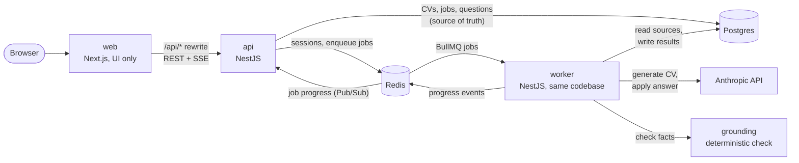

# AI CV Builder

## Run

```sh
cp .env.example .env   # set ANTHROPIC_API_KEY
docker compose up      # http://localhost:3000
```

## Tests

```sh
pnpm install
pnpm test:unit   # no Docker
pnpm test:int    # Testcontainers: Postgres and Redis of its own, needs Docker
```

### LLM evaluation

Runs 10 sample inputs through the production generation loop and grades the drafts with
deterministic checks (a failed check fails the run), an LLM judge, and a blind comparison with
a saved baseline. Needs `ANTHROPIC_API_KEY` in `.env`; no Docker.

```sh
pnpm eval:llm
EVAL_JUDGE=false pnpm eval:llm          # deterministic checks only
EVAL_REPEATS=3 pnpm eval:llm            # every case 3 times
EVAL_SAVE_BASELINE=true pnpm eval:llm   # save this run as the baseline (before a prompt change)
```

Reports: `apps/api/eval/out/`.

## Architecture and main decisions

Next.js (UI only) → NestJS REST API → Postgres; a separate worker process runs the LLM jobs from a
BullMQ queue in Redis. Shared Zod contracts live in `packages/shared`.

- api: REST endpoints, auth (better-auth), autosave, PDF export.
- worker: PDF text extraction, CV generation and answers via Claude, grounding; a sweeper re-enqueues lost jobs.
- Postgres holds all data; **Redis** holds only sessions, the queue, and progress events.



### why chosen

- TS - one language in all pars application, zod as a source schema, prisma, nest, react are oriented for working with TS
- NestJS - app architecture, good for big projects, TS - first, modules, rich infrastructure
- Next.js - SSR, routing system, performance, code splitting
- PostgreSQL + Prisma - working with transactions, row locks, JSONb, prisma gives queries and migrations
- Redis + BullMQ - move out long running operations from HTTP, and run they in queues

## How the AI is kept from inventing facts

- The model must attach an exact quote from the user's PDF or text to every fact.
- Code checks that the quote is in the source and that every number, date, name, and skill of the fact is in the quote (`apps/api/src/grounding/`).
- A fact that fails the check is removed and becomes a question to the user.
- The user's answer becomes a new source; when the AI rewrites that part of the CV, the result is checked again.
- Instructions to the AI hidden in a PDF are dropped, and an answer in the wrong format is
  requested again.

## What I simplified

- Less eval tests
- Didn't test on physical mobile devices just tested in Chrome.
- Tested only in Chrome.
- Didn't optimize build size.
- Didn't optimize server performance.
- Partially skipped form validation
- Simple password strength check (just min length)
- No AI-generated PDFs
- Some columns in the table duplicate the same value and all time empty
- Simple UI
- Briefly generated code checking

## How I used AI tools

- CLAUDE.md contains rules for the agent, how to run project, invariants
- I wrote a specification first, then split into phases.
- the work went phase by phase. I checked every phase. Manual testing.
- Setup project skills, part of skills used from my local config file such: commit-plan, context7-mcp
- A few claude code sessions at the time, no custom subagents
