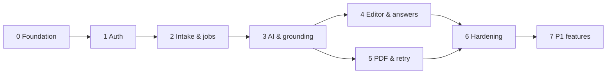

# AI CV Builder — Development Plan

Derived from [`docs/SPEC.md`](../SPEC.md) v1.2. Each phase ends in a runnable, tested state; nothing in a later phase is required to demo an earlier one. Test strategy: [testing.md](testing.md).

## Phases

| # | Phase | Covers | Plan |
|---|---|---|---|
| 0 | Foundation | §6, NFR-R8, R9, S8, S10; test harness and CI | [phase-0-foundation.md](phase-0-foundation.md) |
| 1 | Auth & data isolation | FR-1, FR-2, NFR-S1–S3, R12 | [phase-1-auth.md](phase-1-auth.md) |
| 2 | CV intake & job pipeline | FR-3, FR-4, FR-5, FR-12.1–12.3, NFR-R1–R7, R10, S4, S5, S9, M4 | [phase-2-intake-and-jobs.md](phase-2-intake-and-jobs.md) |
| 3 | AI generation & grounding | FR-6, FR-7, FR-8.1–8.2, NFR-R3, R4, R5, S6 | [phase-3-ai-generation.md](phase-3-ai-generation.md) |
| 4 | Editor, questions, apply answer | FR-8.3–8.6, FR-9 (P0), FR-10 (P0), NFR-M1–M3, M5, M6, M8 | [phase-4-editor-and-answers.md](phase-4-editor-and-answers.md) |
| 5 | PDF export & retry | FR-11, AC-5.6 retry | [phase-5-pdf-and-lifecycle.md](phase-5-pdf-and-lifecycle.md) |
| 6 | Hardening & release | §5.4 (P0), NFR-R8, R10–R12, M1, M7, README | [phase-6-hardening.md](phase-6-hardening.md) |
| 7 | P1 features | AC-10.2, 12.4 (FR-13, AC-9.6, 10.5, Playwright P1 skipped) | [phase-7-p1.md](phase-7-p1.md) |

Phases 4 and 5 are independent of each other once phase 3 is done.

## Working rules

1. **P0 before P1, reliability is never traded for features.** Grounding, isolation, idempotency, and job recovery are part of P0 and are never simplified to ship a feature sooner.
2. **Tests ship with the phase.** Each phase has its own test list and Definition of Done. Phase 6 adds only cross-cutting suites and the final pass.
3. **The LLM is behind an interface from day one.** Phase 2 runs the whole pipeline on a `FakeLlmClient`; Phase 3 adds the Anthropic implementation. No test needs a real `ANTHROPIC_API_KEY`.
4. **Postgres is the source of truth** (SPEC §6.1). Anything put in Redis must be either ephemeral or rebuildable from Postgres.
5. **Shared contracts first.** Zod schemas, CV document types, and error codes live in `packages/shared` and are written before the endpoint or form that uses them.
6. **Docs move with the code.** Root `README.md` and `CLAUDE.md` are created in Phase 0. Every phase's Definition of Done includes updating them: new commands and invariants go to `CLAUDE.md`, user-facing setup goes to the README. Phase 6 finalizes the README.
7. **Jobs are at-least-once.** Any job may run twice (BullMQ stalled recovery, sweeper re-enqueue). Results are written whole, and the worker re-checks the DB state before every write.

## Cross-cutting conventions

These are fixed in Phase 0 so that later phases don't renegotiate them.

- **IDs:** UUID v4 for every entity, including CV entries, bullets, links, and skills inside the JSON document (stable addressing for questions, patches, highlights, and the id-based AI merge).
- **Field paths** (SPEC glossary): a field — `contact.email`, `summary`, `experience.<entryId>.title`, `experience.<entryId>.dates`, `experience.<entryId>.bullets.<bulletId>`, `education.<entryId>.institution`, `skills.<skillId>` — or a whole list or section — `experience.<entryId>.bullets`, `education`. Used by questions, `PATCH` ops, `userEdited` tracking, and highlights.
- **Dates:** `{ start, end }`, each `YYYY` or `YYYY-MM`; `end` may be `present`.
- **Error shape:** `{ code, message, fields? }`. Codes are an enum in `packages/shared` (`VALIDATION_ERROR`, `NOT_FOUND`, `VERSION_CONFLICT`, `ACTIVE_JOB_EXISTS`, `RATE_LIMITED`, `PAYLOAD_TOO_LARGE`, `UNSUPPORTED_MEDIA_TYPE`, `SERVICE_UNAVAILABLE`, `PDF_NO_TEXT`, `PDF_ENCRYPTED`, `PDF_CORRUPTED`, `PDF_TOO_MANY_PAGES`, `PDF_EXPIRED`, `LLM_UNAVAILABLE`, `LLM_INVALID_OUTPUT`, `JOB_TIMEOUT`, …).
- **Job states:** `queued → running → completed | failed | cancelled` (`cancelled` only when Regenerate cancels `apply_answer` jobs), with stage `queued | extracting | generating | validating | applying | completed | failed`.
- **Question statuses** (AC-8.6): `open`, `applying`, `answered`, `dismissed`, `resolved`, `failed`.
- **Counters on the CV:** `version` changes on every write (optimistic locking for `PATCH`); `aiRevision` changes only on AI writes (fencing for `apply_answer`).
- **Logs:** JSON (pino) with `requestId`, `jobId`, `stage`, `durationMs`, token counts, filtered-fact counts. Never CV text, emails, answers, or keys.

## Project skills to use

| Area | Skill (in `.claude/skills/`) |
|---|---|
| Prisma 7 setup, client, migrations | `prisma-upgrade-v7`, `prisma-client-api`, `prisma-cli` |
| Postgres schema, indexes, locks | `supabase-postgres-best-practices` |
| better-auth | `better-auth-best-practices`, `better-auth-security-best-practices`, `email-and-password-best-practices` |
| NestJS | `nestjs-best-practices` |
| Next.js / React | `vercel-react-best-practices` |
| shadcn on Base UI | `shadcn` |
| Unit / integration tests | `vitest` |
| Browser checks | `webapp-testing` |
| Anthropic SDK | built-in `claude-api` |
| Library docs (BullMQ, ioredis, Base UI, react-pdf, Testcontainers) | `context7-mcp` |
